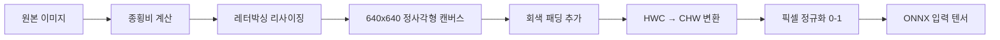

# YOLOv9 ONNX Test

YOLOv9 (You Only Look Once v9) 객체 검출을 Rust로 구현한 프로젝트입니다. ONNX Runtime으로 추론하고, egui 기반 GUI로 시각화합니다.

## 주요 기능

- **여러 모델 임베딩/선택**: `assets/models`의 모델들을 바이너리에 임베딩. 콤보박스로 모델 선택, 선택 시 1회 로딩 후 캐시 재사용
- **ONNX 추론 + 모델 캐싱**: ONNX Runtime 사용, 모델 세션 캐시로 빠른 재추론
- **egui 오버레이 렌더링**: 원본 이미지를 그대로 표시하고, 그 위에 bbox와 라벨을 egui로 오버레이
- **줌/패닝**: 설정 패널 슬라이더 및 우측 이미지 영역 마우스 휠로 줌, 이미지 드래그로 스크롤 이동
- **검출 테이블**: 체크박스로 표시 대상 선택(기본 전체 선택), 컬럼 헤더 클릭으로 정렬(ASC/DESC), Select All/None 버튼 제공
- **이미지 전처리**: 레터박싱 기반 리사이즈 및 정규화
- **NMS 및 후처리**: 중복 제거, 작은 박스 제거, 최대 50개로 제한
- **추론 시간 표시/에러 처리**: 실시간 성능, 오류 메시지 표시

## 설치 및 실행

### 요구사항

- Rust 최신 안정판(예: 1.74+ 권장)
- Windows/macOS/Linux 지원 (테스트 환경은 다양함)

### 설치

#### 1. 프로젝트 클론

```bash
git clone https://github.com/cellaxon/yolov9_onnx_test
cd yolov9_onnx_test
```

#### 2. 모델 준비 (임베딩)

`assets/models` 폴더에 다음 중 하나 이상의 모델 파일을 넣습니다. 이 폴더의 파일은 빌드 시 바이너리에 임베딩됩니다(파일 변경 시 재빌드 필요).

지원 파일(예정):

- `gelan-c.onnx`
- `gelan-e.onnx`
- `yolov9-c.onnx`
- `yolov9-e.onnx`

**다운로드 방법**:

```bash
# assets/models 폴더 생성 (없는 경우)
mkdir -p assets/models

# 방법 1: 웹 브라우저에서 직접 다운로드
# https://huggingface.co/Xenova/yolov9-onnx/tree/main 에서 파일 클릭 후 다운로드

# 방법 2: Git LFS를 사용한 다운로드 (선택사항)
git lfs install
git clone https://huggingface.co/Xenova/yolov9-onnx
cp yolov9-onnx/yolov9-c.onnx assets/models/

# 방법 3: wget을 사용한 다운로드 (Linux/macOS)
wget https://huggingface.co/Xenova/yolov9-onnx/resolve/main/yolov9-c.onnx -O assets/models/yolov9-c.onnx
```

**권장 모델**:

- **기본 사용**: `yolov9-c.onnx` (205 MB)
- **경량화**: `gelan-c.onnx` (102 MB)
- **고정밀**: `yolov9-e.onnx` (278 MB)

**Hugging Face에서 다운로드 가능한 모델들**:

| 모델명 | 파일 크기 | 설명 | 특징 |
|--------|-----------|------|------|
| **YOLOv9-c** | 205 MB | YOLOv9 Compact 버전 | 빠른 추론 속도, 실시간 처리에 적합 |
| **YOLOv9-e** | 278 MB | YOLOv9 Extended 버전 | 높은 정확도, 정밀한 검출에 적합 |
| **GELAN-c** | 102 MB | GELAN Compact 버전 | YOLOv9의 개선된 경량 버전 |
| **GELAN-e** | 233 MB | GELAN Extended 버전 | GELAN의 확장 버전, 높은 정확도 |

**모델 선택 가이드**:

- **실시간 처리**: YOLOv9-c (205 MB) 또는 GELAN-c (102 MB)
- **높은 정확도**: YOLOv9-e (278 MB) 또는 GELAN-e (233 MB)
- **메모리 제약**: GELAN-c (102 MB) - 가장 작은 크기
- **최고 성능**: YOLOv9-e (278 MB) - 가장 큰 모델

참고: 모델 파일은 빌드 시 임베딩되므로 파일을 바꾸거나 추가한 경우 재빌드가 필요합니다.

#### 3. 프로젝트 빌드

```bash
cargo build
```

### 실행

```bash
cargo run --release
```

## 프로젝트 구조

```
yolov9_onnx_test/
├── src/
│   ├── main.rs          # 메인 실행 파일
│   ├── lib.rs           # 핵심 라이브러리 (ONNX 추론, 이미지 처리, API)
│   ├── gui.rs           # egui 기반 GUI 구현(오버레이, 줌/패닝, 테이블)
│   └── models.rs        # 모델 파일 임베딩(include_dir), 목록/바이트 제공
├── assets/
│   └── models/
│       ├── gelan-c.onnx
│       ├── gelan-e.onnx
│       ├── yolov9-c.onnx
│       └── yolov9-e.onnx
├── Cargo.toml
└── README.md
```

## 사용된 기술

### 핵심 라이브러리

- **ort**: ONNX Runtime Rust 바인딩 (v1.16.0)
- **image**: 이미지 처리 및 변환
- **ndarray**: 다차원 배열 연산
- **imageproc**: 이미지 처리 및 그리기

### GUI 라이브러리

- **egui**: 즉시 모드 GUI 프레임워크
- **eframe**: egui 애플리케이션 프레임워크
- **rfd**: 파일 다이얼로그

### 기타

- **anyhow**: 에러 처리

## 기능 상세

### 객체 검출

- 지원 모델: `gelan-c`, `gelan-e`, `yolov9-c`, `yolov9-e`
- 80개 COCO 클래스 검출
- 신뢰도 임계값: 기본 0.60 (설정에서 변경 가능)
- NMS 임계값: 기본 0.20 (설정에서 변경 가능)
- 바운딩 박스 좌표 변환 및 유효성 검증
- 최대 검출 수: 50개로 제한(성능 안정화)
- 출력 텐서 구조 예: (1, 84, N) 형태 처리

### 이미지 처리

- **레터박싱**: 종횡비를 유지하면서 640x640 리사이징
- HWC → CHW 변환
- 픽셀 값 정규화 (0-255 → 0-1)
- 바운딩 박스 및 클래스 정보 시각화

### GUI 인터페이스

- **모델 선택**: 상단 콤보박스로 임베딩된 모델 선택(변경 시 1회 로딩 후 캐시)
- **설정**: Confidence/NMS 슬라이더 + 직접 입력, 이미지 줌(슬라이더/텍스트/100%/Fit)
- **검출 테이블**: 체크박스(표시 온오프), 헤더 클릭 정렬, Select All/None
- **오버레이**: 원본 이미지 위에 bbox/라벨 egui로 렌더링(선택 항목만 표시)
- **줌/패닝**: 우측 영역 어디서든 마우스 휠로 줌, 클릭 드래그로 스크롤 이동
- **추론 시간/에러**: 상단에 표시

## 프로그램 실행 흐름

### 애플리케이션 시작 및 이미지 처리 흐름

```mermaid
flowchart TD
    A[프로그램 시작] --> B[GUI 초기화]
    B --> C[메인 윈도우 생성]
    C --> D[좌측 패널: 검출 결과]
    C --> E[우측 패널: 이미지 표시]
    
    F[이미지 선택 방법] --> G{선택 방식}
    G -->|파일 선택 버튼| H[파일 다이얼로그 열기]
    G -->|드래그 앤 드롭| I[이미지 파일 드롭]
    
    H --> J[이미지 파일 선택]
    I --> J
    J --> K[이미지 파일 읽기]
    K --> L{파일 읽기 성공?]
    L -->|실패| M[에러 메시지 표시]
    L -->|성공| N[ModelCache 초기화]
    
    N --> O{모델 캐시 생성 성공?}
    O -->|실패| P[캐시 초기화 에러 표시]
    O -->|성공| Q[이미지 전처리 시작]
    
    Q --> R[레터박싱 리사이징]
    R --> S[HWC → CHW 변환]
    S --> T[픽셀 정규화 0-1]
    T --> U[ONNX 모델 추론]
    
    U --> V[추론 시간 측정]
    V --> W[모델 출력 파싱]
    W --> X[바운딩 박스 좌표 추출]
    X --> Y[클래스 확률 계산]
    Y --> Z[신뢰도/NMS 후처리]
    
    Z --> AA[검출 결과 생성]
    AA --> EE[GUI 텍스처 로딩(원본 이미지)]
    EE --> GG[우측: egui 오버레이로 bbox/라벨 렌더]
    EE --> FF[좌측: 검출 테이블/정렬/선택]
    EE --> HH[추론 시간 표시]
```

### 상세 처리 단계

#### 1. 이미지 전처리 단계



#### 2. 모델 추론 및 후처리 단계

```mermaid
flowchart LR
    A[ONNX 모델 입력] --> B[YOLOv9/GELAN 추론]
    B --> C[출력 텐서 [1, 84, N]]
    C --> D[바운딩 박스 좌표 파싱]
    C --> E[클래스 확률 계산]
    D --> F[center_x, center_y, width, height]
    E --> G[시그모이드 적용]
    F --> H[레터박싱 좌표 변환]
    G --> I[임계값/신뢰도 필터링]
    H --> J[검출 결과 생성]
    I --> J
    J --> K[NMS 적용]
    K --> L[GUI: egui 오버레이로 시각화]
    L --> M[원본 텍스처 + 오버레이 결과]
```

## 성능

### 테스트 환경

- **OS**: macOS 14.5.0
- **CPU**: Apple Silicon
- **ONNX Runtime**: v1.16.0
- **테스트 이미지**: 164KB JPEG (640x480)

### 성능 결과

**모델별 성능 비교** (macOS M4 기준):

| 모델 | 파일 크기 | 추론 시간 | 정확도 | 메모리 사용량 | 권장 용도 |
|------|-----------|-----------|--------|---------------|-----------|
| **GELAN-c** | 102 MB | ~150-200 ms | 높음 | 낮음 | 실시간 처리, 모바일 |
| **YOLOv9-c** | 205 MB | ~200-300 ms | 높음 | 중간 | 일반적인 사용 |
| **GELAN-e** | 233 MB | ~300-400 ms | 매우 높음 | 중간 | 정밀 검출 |
| **YOLOv9-e** | 278 MB | ~400-500 ms | 최고 | 높음 | 연구, 정밀 분석 |

**테스트 결과 예시** (YOLOv9-c 모델):

```
Found 4 objects:
1. person (Confidence: 89.7%, BBox: [0.586, 0.051, 0.905, 1.000])
2. person (Confidence: 86.9%, BBox: [0.093, 0.270, 0.905, 1.000])
3. snowboard (Confidence: 72.0%, BBox: [0.338, 0.605, 0.412, 1.000])
4. snowboard (Confidence: 58.2%, BBox: [0.771, 0.433, 0.885, 0.989])
⏱️ Inference Time: ~200-300 ms
```

**성능 최적화 팁**:

- **빠른 추론**: GELAN-c 모델 사용 (102 MB)
- **정확도 우선**: YOLOv9-e 모델 사용 (278 MB)
- **균형**: YOLOv9-c 모델 사용 (205 MB) - 기본 권장

## 라이선스

이 프로젝트는 MIT 라이선스 하에 배포됩니다.

## 기여

버그 리포트, 기능 요청, 풀 리퀘스트를 환영합니다.

---

**참고**: 이 프로젝트는 교육 및 연구 목적으로 개발되었습니다. 프로덕션 환경에서 사용하기 전에 충분한 테스트를 권장합니다.
