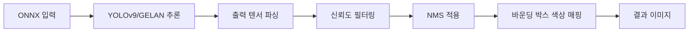

# YOLOv9 ONNX Object Detection Application

YOLOv9 모델을 사용한 객체 검출 애플리케이션입니다. ONNX Runtime을 통해 추론을 수행하며, egui 기반의 GUI 인터페이스를 제공합니다.

## 🚀 주요 기능

### 🔍 객체 검출
- YOLOv9 모델을 사용한 실시간 객체 검출
- COCO 데이터셋의 80개 클래스 지원
- 신뢰도 임계값 및 NMS 임계값 조정 가능
- Pre-NMS 데이터 캐싱으로 빠른 재처리
- **신뢰도 기반 바운딩 박스 색상 매핑**

### 🖥️ GUI 인터페이스
- egui 기반의 현대적인 사용자 인터페이스
- **자연로그 기반 세밀한 줌 제어**
- 실시간 이미지 줌 및 패닝
- 검출 결과 테이블 형태 표시 (정렬, 필터링)
- 키보드 단축키 지원
- **바운딩 박스 색상 매핑 모드 선택**
- 설정 패널 (임계값, 줌, 색상 모드)
- 드래그 앤 드롭으로 이미지 로드

### 💾 캐싱 시스템
- SQLite 데이터베이스를 사용한 추론 결과 캐싱
- 이미지 해시 기반 중복 검출 방지
- 설정 가능한 캐시 정리 정책 (30일)
- **Pre-NMS 데이터 저장으로 NMS 재실행 최적화**
- 강제 재추론 옵션

### ⚙️ 설정 관리
- 중앙화된 설정 시스템 (`CONFIG` 정적 인스턴스)
- 런타임 설정 변경 지원
- 모듈화된 설정 구조
- **컴파일 타임 상수 관리**

### 🎨 바운딩 박스 색상 시스템
- **고정 색상 모드**: 모든 박스를 빨간색으로 표시
- **범위별 색상 모드**: 5단계 색상 (파랑→초록→노랑→주황→빨강)
- **그라데이션 모드**: 선형 색상 전환
- **HSV 기반 모드**: 자연스러운 색상 전환 (기본값)

## 📁 프로젝트 구조

```
yolov9_onnx_test/
├── src/
│   ├── lib.rs          # 메인 라이브러리 (ONNX 추론, 이미지 처리, 캐싱)
│   ├── main.rs         # 애플리케이션 진입점
│   ├── gui.rs          # egui 기반 GUI 구현
│   ├── models.rs       # 임베디드 모델 관리
│   ├── config.rs       # 설정 관리 및 구조체
│   ├── error.rs        # 커스텀 에러 처리 (thiserror 사용)
│   └── utils.rs        # 유틸리티 함수들
│       ├── image_utils     # 이미지 처리 유틸리티
│       ├── math_utils      # 수학 계산 함수들 (IoU, 거리 등)
│       ├── fs_utils        # 파일 시스템 유틸리티
│       ├── perf_utils      # 성능 측정 도구
│       └── color_utils     # 색상 처리 유틸리티
├── Cargo.toml          # 프로젝트 의존성
├── Cargo.lock          # 의존성 잠금 파일
├── check.sh            # Linux/macOS 실행 스크립트
├── check.bat           # Windows 실행 스크립트
└── README.md           # 프로젝트 문서
```

**중요**: `assets/models/` 폴더의 ONNX 파일은 컴파일 타임에 `include_dir!` 매크로로 바이너리에 임베딩됩니다. 따라서 빌드 전에 모델 파일을 `assets/models/`에 내려받아야 합니다.

## 🛠️ 설치 및 실행

### 요구사항
- Rust 1.70+
- Windows/macOS/Linux

### 모델 다운로드
- 지원 모델: `gelan-c.onnx`, `gelan-e.onnx`, `yolov9-c.onnx`, `yolov9-e.onnx`
- 다운로드 위치: [Hugging Face: Xenova/yolov9-onnx](https://huggingface.co/Xenova/yolov9-onnx/tree/main)

```bash
# 1) 디렉토리 생성
mkdir -p assets/models

# 2) 모델 다운로드 (예시)
# 권장: 경량 GELAN-c, 기본 YOLOv9-c, 고정밀 YOLOv9-e, GELAN-e
curl -L -o assets/models/gelan-c.onnx https://huggingface.co/Xenova/yolov9-onnx/resolve/main/gelan-c.onnx
curl -L -o assets/models/yolov9-c.onnx https://huggingface.co/Xenova/yolov9-onnx/resolve/main/yolov9-c.onnx
# 선택적으로 추가 다운로드
curl -L -o assets/models/gelan-e.onnx https://huggingface.co/Xenova/yolov9-onnx/resolve/main/gelan-e.onnx
curl -L -o assets/models/yolov9-e.onnx https://huggingface.co/Xenova/yolov9-onnx/resolve/main/yolov9-e.onnx
```

> 빌드 시 해당 파일들이 존재해야 임베딩됩니다. 모델 파일명을 변경하지 말고 그대로 두는 것을 권장합니다.

## 🧠 모델 상세 안내

### 지원 모델 및 특징
- 입력 크기: 640×640 고정 (본 프로젝트 기본값)
- 클래스: COCO 80 classes
- 출력: YOLOv9 형식 (bbox + class scores), 후처리로 NMS 적용

| 모델명 | 파일명 | 대략 크기 | 설명 | 특징 |
|---|---|---|---|---|
| YOLOv9-C | `yolov9-c.onnx` | ~205 MB | YOLOv9 Compact | 속도/정확도 균형, 범용 |
| YOLOv9-E | `yolov9-e.onnx` | ~278 MB | YOLOv9 Extended | 최고 정확도, 자원 사용 큼 |
| GELAN-C | `gelan-c.onnx` | ~102 MB | 경량화 모델 | 가장 가벼움, 빠른 추론 |
| GELAN-E | `gelan-e.onnx` | ~233 MB | 확장 경량 모델 | 정확도 향상, 여전히 경량 |

### 모델 선택 가이드
- 실시간(속도 우선): **GELAN-C** 또는 **YOLOv9-C**
- 정확도 우선: **YOLOv9-E** 또는 **GELAN-E**
- 메모리 제약: **GELAN-C**
- 균형/기본 권장: **YOLOv9-C**

### 플랫폼/런타임 참고
- macOS: CoreML + ANE 가속 경로 사용(가능 시), CPU fallback 자동
- 기타 OS: CPU Execution Provider 사용, 스레드 설정으로 최적화
- 모델 파일은 빌드 시 임베딩되므로 파일 경로 의존 없이 동작

### 빌드
```bash
cargo build --release
```

### 실행
```bash
# Linux/macOS
./check.sh

# Windows
check.bat

# 또는 직접 실행
cargo run
```

## 🎮 사용법

### 기본 사용법
1. 애플리케이션 실행
2. "Select Image" 버튼 클릭하여 이미지 선택
3. 모델 선택 (임베디드된 ONNX 파일)
4. 신뢰도 및 NMS 임계값 조정
5. **바운딩 박스 색상 매핑 모드 선택**
6. 검출 결과 확인

### 줌 컨트롤
- **마우스 휠**: **자연로그 기반 세밀한 줌 조정** (0.02 로그 단위)
- **Ctrl + Plus/Minus**: 키보드 줌 (0.05 로그 단위)
- **0**: 100% 줌으로 리셋
- **1**: 50% 줌
- **2**: 200% 줌
- **Fit**: 화면에 맞춤
- **줌 범위**: 0.1x - 20.0x (자연로그 기반)

### 설정 조정
- **Confidence Threshold**: 검출 신뢰도 임계값 (0.1-1.0)
- **NMS Threshold**: 중복 제거 임계값 (0.05-0.8)
- **Image Zoom**: 이미지 확대/축소 (자연로그 기반 슬라이더)
- **Color Mapping Mode**: 바운딩 박스 색상 매핑 방식

### 고급 기능
- **강제 재추론**: 캐시 무시하고 새로 추론
- **Pre-NMS 캐싱**: NMS 임계값 변경 시 빠른 재처리
- **테이블 정렬**: 인덱스, 클래스, ID, 신뢰도별 정렬
- **선택적 표시**: 신뢰도 기반 검출 결과 필터링

## ⚙️ 설정 시스템

### 설정 구조
```rust
pub struct AppConfig {
    pub model: ModelConfig,        // 모델 관련 설정
    pub inference: InferenceConfig, // 추론 관련 설정
    pub ui: UiConfig,              // UI 관련 설정
    pub database: DatabaseConfig,   // 데이터베이스 설정
}
```

### 주요 설정값들
- **모델 입력 크기**: 640x640
- **기본 신뢰도 임계값**: 0.6
- **기본 NMS 임계값**: 0.2
- **최대 검출 개수**: 50
- **줌 범위**: 0.1x - 20.0x (자연로그 기반)
- **마우스 휠 줌 변화량**: 0.02 (로그 공간)
- **키보드 줌 변화량**: 0.05 (로그 공간)
- **기본 색상 모드**: HSV 기반
- **파싱 최소 신뢰도**: 0.05 (고급)

## 🔄 캐싱 시스템

### 데이터베이스 구조
```sql
CREATE TABLE inference_cache (
    id INTEGER PRIMARY KEY AUTOINCREMENT,
    image_path TEXT NOT NULL,
    image_hash TEXT NOT NULL,
    model_file_name TEXT NOT NULL,
    model_name TEXT NOT NULL,
    image_width INTEGER NOT NULL,
    image_height INTEGER NOT NULL,
    detections_json TEXT NOT NULL,
    created_at DATETIME DEFAULT CURRENT_TIMESTAMP,
    UNIQUE(image_path, model_file_name)
);
```

### 캐시 기능
- 이미지 해시 기반 중복 검출
- 모델별 캐시 분리
- 자동 캐시 정리 (30일)
- 강제 재추론 옵션
- **Pre-NMS 데이터 저장으로 NMS 재실행 최적화**
- 인덱스 기반 성능 향상 (예: `idx_image_hash`, `idx_model_file`)

## 🎨 바운딩 박스 색상 시스템

### 색상 매핑 모드

#### 1. 고정 색상 모드 (Fixed)
- 모든 바운딩 박스를 빨간색으로 표시
- 가장 단순한 모드

#### 2. 범위별 색상 모드 (Range-Based)
- 5단계 색상 구분:
  - 0.0-0.2: 파랑 (낮은 신뢰도)
  - 0.2-0.4: 초록
  - 0.4-0.6: 노랑
  - 0.6-0.8: 주황
  - 0.8-1.0: 빨강 (높은 신뢰도)

#### 3. 그라데이션 모드 (Gradient)
- 선형 색상 전환
- 신뢰도에 따른 부드러운 색상 변화

#### 4. HSV 기반 모드 (HSV-Based) - **기본값**
- HSV 색상 공간을 활용한 자연스러운 전환
- 가장 시각적으로 매력적인 모드

### 색상 처리 유틸리티
```rust
// 범위별 색상
pub fn get_confidence_color(confidence: f32) -> Rgb<u8>

// 그라데이션 색상
pub fn get_confidence_color_gradient(confidence: f32) -> Rgb<u8>

// HSV 기반 색상
pub fn get_confidence_color_hsv(confidence: f32) -> Rgb<u8>
```

## 🧭 프로그램 실행 흐름 (Mermaid)

### 전체 흐름
```mermaid
flowchart TD
    A[프로그램 시작] --> B[GUI 초기화]
    B --> C[메인 윈도우 생성]
    C --> D[좌측 패널: 검출 결과]
    C --> E[우측 패널: 이미지 표시]

    F[이미지 선택 방법] --> G{선택 방식}
    G -->|파일 선택 버튼| H[파일 다이얼로그 열기]
    G -->|드래그 앤 드롭| I[이미지 파일 드롭]

    H --> J[이미지 파일 선택]
    I --> J
    J --> K[이미지 파일 읽기]
    K --> L{파일 읽기 성공?}
    L -->|실패| M[에러 메시지 표시]
    L -->|성공| N[ModelCache 초기화]

    N --> O{모델 캐시 생성 성공?}
    O -->|실패| P[캐시 초기화 에러 표시]
    O -->|성공| Q[Pre-NMS 추론/로드]

    Q --> R{DB 캐시 존재?}
    R -->|있음| S[Pre-NMS 결과 로드]
    R -->|없음| T[모델 추론(Pre-NMS 저장)]

    S --> U[NMS 적용]
    T --> U[NMS 적용]
    U --> V[바운딩 박스 그리기]
    V --> W[결과 이미지 표시]

    M --> X[사용자 재시도 대기]
    P --> X
    X --> F
```

### 이미지 전처리 파이프라인


### 추론 및 후처리 파이프라인


## 🚀 성능 최적화

### 추론 최적화
- ONNX Runtime 최적화 레벨 설정 (Level1)
- **플랫폼별 최적화**:
  - **macOS**: CoreML + ANE (Apple Neural Engine) 활용
  - **기타 플랫폼**: CPU 최적화 (16 intra-threads, 8 inter-threads)
- 메모리 패턴 최적화
- **Pre-NMS 데이터 캐싱으로 NMS 재실행 최적화**

### GUI 최적화
- **자연로그 기반 줌 제어** (매우 세밀한 조정)
- 효율적인 이미지 렌더링
- 가상화된 테이블 표시
- 비동기 이미지 처리
- **색상 매핑 최적화**

## 🐛 에러 처리

### 에러 타입 (`thiserror` 사용)
- `ImageError`: 이미지 처리 오류
- `OrtError`: ONNX 런타임 오류
- `DatabaseError`: 데이터베이스 오류
- `ValidationError`: 유효성 검사 오류
- `ConfigError`: 설정 오류
- `CacheError`: 캐시 오류

### 에러 처리 전략
- **패닉 방지**: 모든 `unwrap()` 제거
- Graceful degradation
- 사용자 친화적 에러 메시지
- 자동 복구 시도
- 상세한 로깅
- **커스텀 에러 타입으로 타입 안전성 확보**

## 📊 성능 측정

### 측정 항목
- 추론 시간 (밀리초)
- 이미지 로딩 시간
- GUI 렌더링 시간
- 캐시 히트율
- **색상 처리 성능**

### 성능 최적화 팁
- SSD 사용 권장
- 충분한 RAM 확보 (8GB+)
- **macOS에서 CoreML + ANE 활용**
- 정기적인 캐시 정리
- **자연로그 줌으로 부드러운 사용자 경험**

## 🔧 개발 정보

### 의존성
- `ort`: ONNX Runtime
- `eframe`/`egui`: GUI 프레임워크
- `image`/`imageproc`: 이미지 처리
- `rusqlite`: SQLite 데이터베이스
- `serde`: 직렬화/역직렬화
- **`thiserror`: 커스텀 에러 처리**
- **`once_cell`: 지연 정적 초기화**
- `ndarray`: 수치 계산
- `sha2`: 해시 계산
- `include_dir`: 컴파일 타임 파일 임베딩

### 빌드 최적화
```toml
[profile.release]
opt-level = 3
lto = true
codegen-units = 1
panic = "abort"
```

### 코드 구조 개선
- **모듈화**: `config`, `error`, `utils` 모듈 분리
- **중앙화된 설정**: `CONFIG` 정적 인스턴스
- **유틸리티 함수 분리**: 공통 기능 모듈화
- **타입 안전성**: 커스텀 에러 타입 사용
- **컴파일 타임 임베딩**: 모델 파일을 바이너리에 포함
- **플랫폼별 최적화**: macOS CoreML, CPU 최적화

## 📝 라이센스

이 프로젝트는 MIT 라이센스 하에 배포됩니다.

## 🤝 기여

버그 리포트, 기능 제안, 풀 리퀘스트를 환영합니다!

## 📞 지원

문제가 발생하면 이슈를 생성해 주세요. 