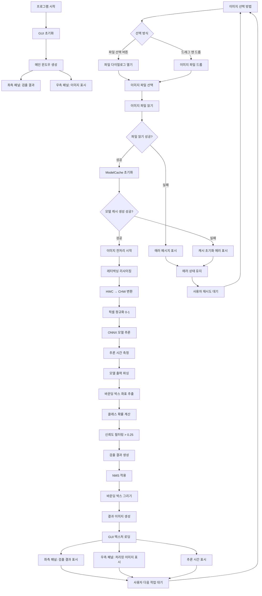
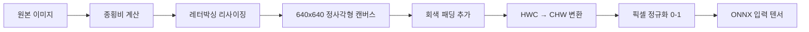

# YOLOv9 ONNX Test

YOLOv9 (You Only Look Once version 9) 객체 검출 모델을 Rust로 구현한 프로젝트입니다. ONNX Runtime을 사용하여 모델 추론을 수행하고, 직관적인 GUI 인터페이스를 제공합니다.

## 주요 기능

- **ONNX 모델 추론**: YOLOv9-c 모델을 사용한 실시간 객체 검출
- **모델 캐싱**: 빠른 추론을 위한 모델 세션 캐싱
- **추론 시간 측정**: 실시간 추론 성능 모니터링
- **이미지 전처리**: 레터박싱을 통한 종횡비 유지 리사이징 및 정규화
- **NMS (Non-Maximum Suppression)**: 중복 검출 제거
- **바운딩 박스 시각화**: 검출된 객체에 대한 바운딩 박스 및 클래스 정보 표시
- **GUI 인터페이스**: 직관적인 사용자 인터페이스
- **분할 레이아웃**: 좌측 검출 결과, 우측 이미지 표시
- **스크롤 지원**: 양쪽 패널 모두 스크롤 가능
- **드래그 앤 드롭**: 이미지 파일을 직접 드래그하여 로드

## 설치 및 실행

### 요구사항

- Rust 1.70+
- macOS 14.5.0+ (테스트된 환경)
- ONNX Runtime

### 설치

#### 1. ONNX Runtime 설치
```bash
pip install onnxruntime
```

#### 2. 프로젝트 클론
```bash
git clone https://github.com/cellaxon/yolov9_onnx_test
cd yolov9_onnx_test
```

#### 3. 모델 다운로드

프로젝트를 실행하기 전에 YOLOv9-c 모델을 다운로드해야 합니다:

1. [YOLOv9 공식 저장소](https://github.com/WongKinYiu/yolov9)에서 모델 다운로드
2. `yolov9-c.onnx` 파일을 다운로드
3. 다운로드한 파일을 `assets/models/` 폴더에 `yolov9-c.onnx` 이름으로 저장

```bash
# assets/models 폴더 생성 (없는 경우)
mkdir -p assets/models

# 모델 파일을 assets/models/yolov9-c.onnx로 이동
mv ~/Downloads/yolov9-c.onnx assets/models/
```

**동작 가능한 모델** (macOS M4에서 테스트됨):
- ✅ **YOLOv9-c 모델** (`yolov9-c.onnx`): 640x640 입력 크기, 빠른 추론 속도
- ✅ **YOLOv9-e 모델** (`yolov9-e.onnx`): 더 정확하지만 느림
- ✅ **YOLOv9-s 모델** (`yolov9-s.onnx`): 가벼운 모델, 빠른 추론

#### 4. 프로젝트 빌드
```bash
cargo build
```

### 실행

```bash
cargo run --release
```

## 프로젝트 구조

```
yolov9_onnx_test/
├── src/
│   ├── main.rs          # 메인 실행 파일
│   ├── lib.rs           # 핵심 라이브러리 (ONNX 추론, 이미지 처리)
│   └── gui.rs           # egui 기반 GUI 구현
├── assets/
│   └── models/
│       └── yolov9-c.onnx   # YOLOv9-c 모델
├── Cargo.toml
└── README.md
```

## 사용된 기술

### 핵심 라이브러리

- **ort**: ONNX Runtime Rust 바인딩 (v1.16.0)
- **image**: 이미지 처리 및 변환
- **ndarray**: 다차원 배열 연산
- **imageproc**: 이미지 처리 및 그리기

### GUI 라이브러리

- **egui**: 즉시 모드 GUI 프레임워크
- **eframe**: egui 애플리케이션 프레임워크
- **rfd**: 파일 다이얼로그

### 기타

- **anyhow**: 에러 처리

## 기능 상세

### 객체 검출

- YOLOv9-C 모델을 사용한 80개 COCO 클래스 검출
- 신뢰도 점수 기반 필터링 (임계값: 0.5)
- 시그모이드 함수를 통한 클래스 확률 계산
- NMS (Non-Maximum Suppression) 적용 (임계값: 0.3)
- 바운딩 박스 좌표 추출 및 변환
- 바운딩 박스 유효성 검증 (너무 작거나 잘못된 박스 제외)
- 최대 검출 개수 제한 (100개)
- 정확한 COCO 클래스 매핑 (Person=0, Car=2, Dog=16, Cat=15, ...)
- 출력 텐서 구조: (1, 84, 8400) 형태 처리

### 이미지 처리

- **레터박싱**: 종횡비를 유지하면서 640x640 리사이징
- HWC → CHW 변환
- 픽셀 값 정규화 (0-255 → 0-1)
- 바운딩 박스 및 클래스 정보 시각화

### GUI 인터페이스

- **분할 레이아웃**: 좌측 검출 결과, 우측 이미지 표시
- **스크롤 지원**: 양쪽 패널 모두 스크롤 가능
- **드래그 앤 드롭**: 이미지 파일을 직접 드래그하여 로드
- **모델 정보 표시**: 현재 사용 중인 모델 정보
- **실시간 추론 시간 표시**: 파란색으로 강조된 성능 정보
- **에러 처리**: 안전한 오류 처리 및 사용자 피드백

## 프로그램 실행 흐름

### 애플리케이션 시작 및 이미지 처리 흐름



### 상세 처리 단계

#### 1. 이미지 전처리 단계


#### 2. 모델 추론 및 후처리 단계
```mermaid
flowchart LR
    A[ONNX 모델 입력] --> B[YOLOv9-C 추론]
    B --> C[출력 텐서 [1, 84, 8400]]
    C --> D[바운딩 박스 좌표 파싱]
    C --> E[클래스 확률 계산]
    D --> F[center_x, center_y, width, height]
    E --> G[시그모이드 적용]
    F --> H[레터박싱 좌표 변환]
    G --> I[임계값 필터링 > 0.25]
    H --> J[검출 결과 생성]
    I --> J
    J --> K[NMS 적용]
    K --> L[바운딩 박스 그리기]
    L --> M[최종 결과 이미지]
```

## 성능

### 테스트 환경
- **OS**: macOS 14.5.0
- **CPU**: Apple Silicon
- **ONNX Runtime**: v1.16.0
- **테스트 이미지**: 164KB JPEG (640x480)

### 성능 결과

**YOLOv9-c 모델 (640x640)**
```
Found 4 objects:
1. person (Confidence: 89.7%, BBox: [0.586, 0.051, 0.905, 1.000])
2. person (Confidence: 86.9%, BBox: [0.093, 0.270, 0.905, 1.000])
3. snowboard (Confidence: 72.0%, BBox: [0.338, 0.605, 0.412, 1.000])
4. snowboard (Confidence: 58.2%, BBox: [0.771, 0.433, 0.885, 0.989])
⏱️ Inference Time: ~200-300 ms
```

## 라이선스

이 프로젝트는 MIT 라이선스 하에 배포됩니다.

## 기여

버그 리포트, 기능 요청, 풀 리퀘스트를 환영합니다.

---

**참고**: 이 프로젝트는 교육 및 연구 목적으로 개발되었습니다. 프로덕션 환경에서 사용하기 전에 충분한 테스트를 권장합니다. 